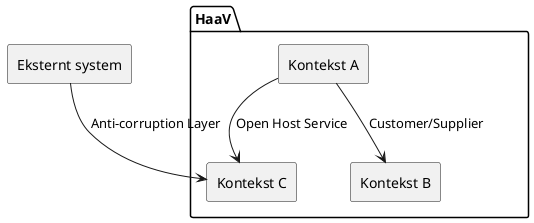

# HaaV - Strategisk domænemodel

**Gruppe:** ______HISE______  **Dato:** ______09/09______

> Udfyld tabellerne mens I arbejder. Skriv kort — én linje pr. felt er nok.
> Der er ikke ét rigtigt svar; det er begrundelserne der tæller.

---

## Tabel 1 - Forretningskompetencer (Trin 1)
Resten af kompetencerne ligger i drev

| Kompetence                                                   | "Evnen til at ..."   | Kort (Bilag B) | Core / Supporting / Generic | Begrundelse (1 linje)                                  |
|--------------------------------------------------------------|----------------------|----------------|-----------------------------|--------------------------------------------------------| 
| Vise et samlet vareudvalg fra alle 27 medlemmer i én webshop | samlet i en webshop  | B2             | Core                        | Det er med til at gøre virksomheden konkurrence dygtig |
| Lade en kunde lægge varer fra flere medlemmer i samme kurv   | samlet kurv på tværv | B3             | Core                        | fordel på marked                                       |
|                                                              |                      |                |                             |                                                        |
|                                                              |                      |                |                             |                                                        |
|                                                              |                      |                |                             |                                                        |
|                                                              |                      |                |                             |                                                        |

**Svære kort — hvor placerede vi dem, og hvorfor?**

- Kort nr. ___ →  fordi ...
- Kort nr. ___ →  fordi ...

### Verifikation af den fastlagte kernekompetence

> **Fælles markedsplads for lokale varer** — evnen til at lade 27 selvstændige forretninger optræde som én butik over for kunden.

| Kriterium | Opfyldt? | Begrundelse                                                                                                                             |
|---|----------|-----------------------------------------------------------------------------------------------------------------------------------------|
| Skaber reel konkurrencefordel | x        | giver stor værdi, for de kunder som gerne vil handle på tværs                                                                           |
| Svær at kopiere | x        | svært at organisere (samarbejde) og bygge (it)                                                                                          |
| Understøtter strategien direkte | x        | ja, løsningen skal være bygget op om at det er en organisation med "medlemer"(små virksomheder) som gerne vil sælge deres ting på tværs |

**Svarer vores kortgruppering til ledelsens afgrænsning — eller havde vi skåret anderledes?**
yes

**Stærkeste anden core-kandidat, og hvorfor den ikke blev valgt:**
Anden kanditat:
Kampagner og nyhedsbrevet var anden kandidat til core, da dette også er deres konkurrencefordel og en del af deres værditilbud, men det er ikke kerneforretningen.

---

## Tabel 2 - Forretningsfunktioner i vores kernekompetence (Trin 2)

**Kernekompetence (fastlagt):** Fælles markedsplads for lokale varer

| Forretningsfunktion | Beskrivelse (1 linje) | Kilde (kortnr. / person i Bilag A) |
|---|---|---|
| | | |
| | | |
| | | |
| | | |
| | | |
| | | |

**Funktion(er) vi fandt i interviewene, som ikke stod på et kort:**

-

---

## Tabel 3 - DDD-underdomæner (Trin 3)

| Underdomæne | Ansvarsområde | Funktioner fra Tabel 2 | Type | Konsekvens (byg / køb / integrér) |
|---|---|---|---|---|
| | | | | |
| | | | | |
| | | | | |
| | | | | |
| | | | | |

**Generiske underdomæner vi får brug for, men ikke bygger selv:**

| Underdomæne | Hvorfor generic? | Hvad gør vi i stedet? |
|---|---|---|
| | | |
| | | |

---

## Sprogtest (Trin 4a)

| Ord | Betydning 1 (hvem siger det) | Betydning 2 (hvem siger det) | → Peger på kontekster |
|---|---|---|---|
| levering | Kunden henter selv i butikken (Bente) | HaaV kører ud til sommerhuse (Dorte) | Afhentning vs. Udbringning |
| vare | | | |
| medlem | | | |
| kunde | | | |
| ordre | | | |
| kampagne | | | |

---

## Tabel 4 - Afgrænsede kontekster (Trin 4b)

### Kontekst 1: _______________________

| | |
|---|---|
| **Underdomæner** | |
| **Nøglebegreber (og betydning *her*)** | |
| **Ejer data om** | |

### Kontekst 2: _______________________

| | |
|---|---|
| **Underdomæner** | |
| **Nøglebegreber (og betydning *her*)** | |
| **Ejer data om** | |

### Kontekst 3: _______________________

| | |
|---|---|
| **Underdomæner** | |
| **Nøglebegreber (og betydning *her*)** | |
| **Ejer data om** | |

<!-- Kopiér blokken hvis I har flere end 3 kontekster -->

---

## Context map (Trin 4c)

Indsæt jeres diagram her (billede, `.drawio`-fil eller PlantUML nedenfor) og udfyld relationstabellen.

| Fra (upstream) | Til (downstream) | Mønster | Hvorfor dette mønster? |
|---|---|---|---|
| | | | |
| | | | |
| | | | |

Valgfrit: PlantUML-skabelon (diagram-as-code, kan versionsstyres)

---

## Trin 5 - Konklusion

**1. Kontekst vi vælger til næste lektion (taktisk DDD) — og hvorfor:**

**2. Hvor hører vores `CatalogService` fra M3.03 til? Én kontekst, eller flere?**

**3. Hvem er "`User`" i vores `UserService`? Passer navnet med sproget i domænet?**
