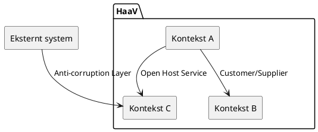

# HaaV - Strategisk domænemodel

**Gruppe:** ______HISE______  **Dato:** ______09/09______

> Udfyld tabellerne mens I arbejder. Skriv kort — én linje pr. felt er nok.
> Der er ikke ét rigtigt svar; det er begrundelserne der tæller.

---

## Tabel 1 - Forretningskompetencer (Trin 1)
Resten af kompetencerne ligger i drev

| Kompetence                                                   | "Evnen til at ..."   | Kort (Bilag B) | Core / Supporting / Generic | Begrundelse (1 linje)                                  |
|--------------------------------------------------------------|----------------------|----------------|-----------------------------|--------------------------------------------------------| 
| Vise et samlet vareudvalg fra alle 27 medlemmer i én webshop | samlet i en webshop  | B2             | Core                        | Det er med til at gøre virksomheden konkurrence dygtig |
| Lade en kunde lægge varer fra flere medlemmer i samme kurv   | samlet kurv på tværv | B3             | Core                        | fordel på marked                                       |
|                                                              |                      |                |                             |                                                        |
|                                                              |                      |                |                             |                                                        |
|                                                              |                      |                |                             |                                                        |
|                                                              |                      |                |                             |                                                        |

**Svære kort — hvor placerede vi dem, og hvorfor?**

- Kort nr. ___ →  fordi ...
- Kort nr. ___ →  fordi ...

### Verifikation af den fastlagte kernekompetence

> **Fælles markedsplads for lokale varer** — evnen til at lade 27 selvstændige forretninger optræde som én butik over for kunden.

| Kriterium | Opfyldt? | Begrundelse                                                                                                                             |
|---|----------|-----------------------------------------------------------------------------------------------------------------------------------------|
| Skaber reel konkurrencefordel | x        | giver stor værdi, for de kunder som gerne vil handle på tværs                                                                           |
| Svær at kopiere | x        | svært at organisere (samarbejde) og bygge (it)                                                                                          |
| Understøtter strategien direkte | x        | ja, løsningen skal være bygget op om at det er en organisation med "medlemer"(små virksomheder) som gerne vil sælge deres ting på tværs |

**Svarer vores kortgruppering til ledelsens afgrænsning — eller havde vi skåret anderledes?**
yes

**Stærkeste anden core-kandidat, og hvorfor den ikke blev valgt:**
Anden kanditat:
Kampagner og nyhedsbrevet var anden kandidat til core, da dette også er deres konkurrencefordel og en del af deres værditilbud, men det er ikke kerneforretningen.

---

## Tabel 2 - Forretningsfunktioner i vores kernekompetence (Trin 2)

**Kernekompetence (fastlagt):** Fælles markedsplads for lokale varer

| Forretningsfunktion         | Beskrivelse (1 linje)                                                       | Kilde (kortnr. / person i Bilag A) |
|-----------------------------|-----------------------------------------------------------------------------|------------------------------------|
| Produktregistrering         | Medlemer opretter deres egne vare på markedspladsen                         | bente og jørn                      |
| Produktpræsentation         | billeder og beskrivelse af historien bag produktet                          | jørn                               |
| Lagerstyring                | viser aktuelle antal vare, så kunden ser det rigtige lagerantal             | Bente                              |
| Online bestilling           | kunder skal kunde bestille vare online                                      | Bente                              |
| Reservation og afhentning   | kunder skal kunne reservere vare og hente dem i den lokale butik            | Bente                              |
| Håndtering af unikke vare   | systemet skal kunne håndtere, hvor varene er fysiske                        | Jørn                               |
| Holdbarhed og udløbsstyring | Vare med begrænset holdbarhed skal kunne håndteres så de sælges inden udløb | Bente                              |

**Funktion(er) vi fandt i interviewene, som ikke stod på et kort:**
håntering af unikke vare og holbarhed (nedereste to)
-
[HaaV-domænemodel.md](HaaV-dom%C3%A6nemodel.md)
---

## Tabel 3 - DDD-underdomæner (Trin 3)
Underdomæne et veldefineret forretningsområde med sine egne
regler, modeller og ansvarsområde. Hver forretningsfunktion kan knyttes til et tilsvarende
underdomæne — men flere funktioner kan godt havne i samme underdomæne, hvis de deler
regler og sprog

| Underdomæne               | Ansvarsområde                         | Funktioner fra Tabel 2 | Type       | Konsekvens (byg / køb / integrér) |
|---------------------------|---------------------------------------|------------------------|------------|----------------------------------|
| Produktkatalog            | Registering og præsentation af vare   |Produktregistrering                  | Core       | byg selv                         |
| Produktkatalog            | R & P af vare                         |Produktpræsentation                  | Core       |                                  |
| Lager                     | Korrekt billede af vare tilgængelighed |  Lagerstyring                      | Generic    | købe / integrer                  |
| Lager                     | korrekt billede                       |       Håndtering af unikke vare                 | Generic    |                                  |
| Lager                     | korrekt billede                       |          Holdbarhed og udløbsstyring              | Generic    |                                  |
| Bestilling og reservation | håndtering af køb og reservation      |       Online bestilling                 | Supporting | byg selv                         |
| Bestilling og reservation | køb og reservation                    |       Reservation og afhentning                 | Supporting |                                  |

**Generiske underdomæner vi får brug for, men ikke bygger selv:**

| Underdomæne | Hvorfor generic?                     | Hvad gør vi i stedet? |
|------------|--------------------------------------|-----------------------|
| Betaling   |                       | vi køber det          |
| CRM system | fordi der allerede findes gode løsninger | køb                   |

---

## Sprogtest (Trin 4a)

| Ord | Betydning 1 (hvem siger det)                               | Betydning 2 (hvem siger det)                                           | → Peger på kontekster                           |
|---|------------------------------------------------------------|------------------------------------------------------------------------|-------------------------------------------------|
| levering | Kunden henter selv i butikken (Bente)                      | HaaV kører ud til sommerhuse (Dorte)                                   | Afhentning vs. Udbringning                      |
| vare | Fysisk vare på hylden (Bente)                              | unik enkeltstående håndværk, hvor hver eksemplar er forkselligt (Jørn) | dagligvare vs. håndværk (medlemmer) eks keramik |
| medlem | Virksomhed, som har aftaler og betaler kontingent (preben) | Nyhedsbrevsmodtagere (mette)                                           | medlemsadministration vs. marketing             |
| kunde | turist, som køber vare (dorte)                             |                                                                        |                                                 |
| ordre | Samlet kurv/køb for kunden (Dorte)                         | Én Ordre per medlem pr afdeling (Preben)                               | CheckOut vs afregning                           |
| kampagne | Haav's Markedsføringskampange (Mette)                      | Tilbud/prisændring lokalt (Bente)                                      | Marketing vs varesalg                           |

---
Vi kunne ikke finde en tydelig forskel på kunde - der bliver brugt kunde og turist

## Tabel 4 - Afgrænsede kontekster (Trin 4b)

### Kontekst 1: Produkt Oplevelse

| |                                                  |
|---|--------------------------------------------------|
| **Underdomæner** | ProduktKatalog                                   |
| **Nøglebegreber (og betydning *her*)** | vare Kampange(tilbud) Produktbeskrivelse |
| **Ejer data om** | Vare produktbeskrivelser billeder        |

### Kontekst 2: KundeKøb 

| |                                                        |
|---|--------------------------------------------------------|
| **Underdomæner** | Bestilling og Reservation                              |
| **Nøglebegreber (og betydning *her*)** | Kunde Kurv Odre Rerservation Afhentning |
| **Ejer data om** | Samme som nøglebegreber                                |

### Kontekst 3: Varetilgængelighed

| |                                                              |
|---|--------------------------------------------------------------|
| **Underdomæner** | Lagerstyrring                                                |
| **Nøglebegreber (og betydning *her*)** | Vare Lagerbeholdning UnikVare Holdbarhed         |
| **Ejer data om** | Lagerantal Tilgængelighed Holdbarhed Lagerstatus |

### Kontekst 4: Medlemsafregning

| |                                                     |
|---|-----------------------------------------------------|
| **Underdomæner** | Afregning                                           |
| **Nøglebegreber (og betydning *her*)** | Medlem Ordre Provision Udbetaling       |
| **Ejer data om** | Medlemsaftaler provitionssater udbetalinger |

---

## Context map (Trin 4c)
Medlemsbasen er et gamelt accessSystem og vi vil derfor gerne sikre at det ikke påvirker vores nye datamodel på en dårlig måde
- der stod der inden dokumentering er på datamodellen og derfor kan vi ikke være sikre på, hvad vi tager ind i det nye

| Fra (upstream)    | Til (downstream)   | Mønster                | Hvorfor dette mønster?                                                   |
|-------------------|--------------------|------------------------|--------------------------------------------------------------------------|
| Produktoplevelse  | Varetilgængelighed | Open Host Service      | Det er en åben API som alle må bruge kan fx være en GET/produkt/{123} |
| Væretilgængelighed | Kundekøb           | Customer / supplier    | for at man kan købe noget, skal der bruges noget tilgængeligheds data    |
| Kundekøb          | Medlemsafregning   | Customer / supplier    | medlemsregningen skal kunne hente ordren for at kunne splitte den op     |
| medlemsbasen      | Medlemsafregning   | Anti-Corruption Layser | Medlemsafregning skal beskytte sin egen datamodel mod det gamle system   |

Valgfrit: PlantUML-skabelon (diagram-as-code, kan versionsstyres)

---

## Trin 5 - Konklusion

**1. Kontekst vi vælger til næste lektion (taktisk DDD) — og hvorfor:**
Vi ville tage fat i den mest upstream kontekst (produktoplevelse) da de andre er alle afhængige af den

**2. Hvor hører vores `CatalogService` fra M3.03 til? Én kontekst, eller flere?**
vi ville sige at den hører under to, produktoplevelse og varetilgængelighed

**3. Hvem er "`User`" i vores `UserService`? Passer navnet med sproget i domænet?**
vi tror det er medlemmer i form af virksomhederne som ligger deres produkter op
men en user kan også være kunden, som skal have en brugere når de køber et produkt

men navngivningen skal laves om, så det passer til konteksterne!