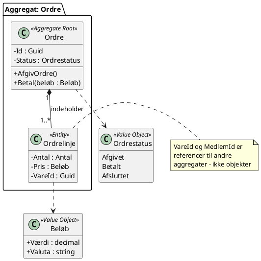

# HaaV - Taktisk domænemodel: Salg og ordre

**Gruppe:** ______________  **Par 1 (Kurv):** ______________  **Par 2 (Ordre):** ______________

---

## Opgave A - Begreberne

**E** = entitet · **V** = værdiobjekt · **X** = hører til i en anden kontekst

| Nr. | Begreb | E/V/X | Begrundelse (kun hvis den ikke er indlysende) | Hvis X: hvilken kontekst, og hvad kender vi den ved? |
|---|---|---|---|---|
| 1 | Kurv | | | |
| 2 | Kurvlinje | | | |
| 3 | Ordre | | | |
| 4 | Ordrelinje | | | |
| 5 | Vare | | | |
| 6 | Varebeskrivelse m. billeder | | | |
| 7 | Medlem | | | |
| 8 | Provisionssats | | | |
| 9 | Kunde | | | |
| 10 | Beløb | | | |
| 11 | Antal | | | |
| 12 | Leveringsadresse | | | |
| 13 | Leveringsmåde | | | |
| 14 | Afhentningskode | | | |
| 15 | Ordrestatus | | | |
| 16 | Sidste salgsdato | | | |

**Vi er uenige om:** _______________________________________

---

## Opgave B - Aggregatet

**Vores aggregat:** ☐ Kurv (par 1)  ☐ Ordre (par 2)

| | |
|---|---|
| **Rod** | |
| **Børn (entiteter der ikke findes uden roden)** | |
| **Værdiobjekter** | |
| **Refereret ved Id (og hvorfor)** | |

### Invarianter

Regler der **altid** skal være sande, når en ændring er færdig. Skriv dem, som en købmand ville sige dem.

| # | Invariant | Involverer rod + barn? | Beskyttes af metoden |
|---|---|---|---|
| 1 | | | |
| 2 | | | |
| 3 | | | |

### Metoder på roden

| Metode (forretningshandling) | Hvad den gør | Hvilken invariant den håndhæver |
|---|---|---|
| | | |
| | | |

**Hvad går i stykker, hvis to brugere ændrer aggregatet samtidigt?**

---

## Opgave C - Hændelser og kommandoer

| Domænehændelse (datid) | Intern / Integration | Hvilken kontekst lytter? | Hvad gør den så? |
|---|---|---|---|
| | | | |
| | | | |
| | | | |
| | | | |

**Kommandoer (bydeform):**

- `...`
- `...`

**Forespørgsel:**

- `...`

**Et sted hvor eventuel konsistens gør en forretningsmæssig forskel:**

---

## Opgave D - Kollisionen

**1. Kurv og Ordre — ét aggregat eller to? Vores beslutning og begrundelse:**

**2. Hændelsen der krydser grænsen:**

**3. Hvad betaler Lise for rugbrødet — og hvor i modellen bor svaret?**

**4. Opdelingen i to afregninger: på `Ordre`, eller i en domænetjeneste? Hvorfor?**

**Bonus — Jørns ene lerskål. Hvilket aggregat, og i hvilken kontekst, beskytter den regel?**

**Fælles skitse:** indsæt foto eller diagram her.

---

## Opgave E - Hjemme

### Klassediagram

<details>
<summary>PlantUML-skabelon</summary>



</details>

### C#-skelet

Sti til klassebibliotek i repo'et: _______________________________________

### Unit test af en invariant

Testens navn: _______________________________________

**Fejler testen, hvis I fjerner reglen fra modellen?** ☐ Ja ☐ Nej — hvis nej: reglen bor ikke, hvor I tror.

### Repository-interface

```csharp
public interface IOrdreRepository
{
    // Kun roden. Ingen metoder der henter eller gemmer et barn direkte.
}
```

**Hvorfor er `HentAlleOrdrelinjer()` en dårlig idé her?**

### Valgfrit: BPMN

Indsæt diagram. Hvert trin annoteret med kommando og hændelse.
