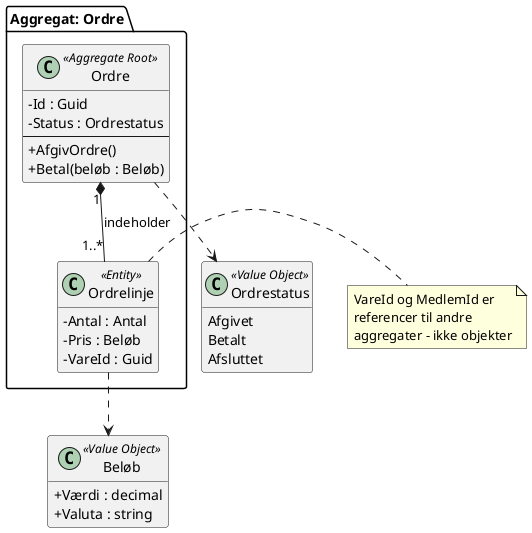

# HaaV - Taktisk domænemodel: Salg og ordre

**Gruppe:** ______________  **Par 1 (Kurv):** ______________  **Par 2 (Ordre):** ______________

---

## Opgave A - Begreberne

**E** = entitet · **V** = værdiobjekt · **X** = hører til i en anden kontekst

| Nr. | Begreb | E/V/X | Begrundelse (kun hvis den ikke er indlysende)                          | Hvis X: hvilken kontekst, og hvad kender vi den ved? |
|---|---|-------|------------------------------------------------------------------------|-----------------------------------------------------|
| 1 | Kurv | E     | har en identitet som bliver, hvor de ting som er i kan ændre sig       |                                                     |
| 2 | Kurvlinje | V     | ikke unik, kan have x i flere kurve                                    |                                                     |
| 3 | Ordre | E     |                                                                        |                                                     |
| 4 | Ordrelinje | V     | Ikke Unik, fordi der kan ligge flere x i samme kurv                    |                                                     |
| 5 | Vare | E     |                                                                        |                                                     |
| 6 | Varebeskrivelse m. billeder | V     | den er ikke unik og har ikke sin egen historie                         |                                                     |
| 7 | Medlem | X     | Data ligger et andet sted                                              |                                                     |
| 8 | Provisionssats | X     | Høre ikke til i salg og ordre                                          |                                                     |
| 9 | Kunde | X     | Data hører ind under noget andet og er noget salg og ordre referer til | KundeId                                             |
| 10 | Beløb | V     |                                                                        |                                                     |
| 11 | Antal | V     |                                                                        |                                                     |
| 12 | Leveringsadresse | x     | Hænger sammen med Leveringskontekst                                    | Levering                                            |
| 13 | Leveringsmåde | x     |                                                                        | Levering                                            |
| 14 | Afhentningskode | x     |                                                                        | Levering                                            |
| 15 | Ordrestatus | V     | "Klar til afhentning", "Ordre modtaget "                               |                                                     |
| 16 | Sidste salgsdato | V     |                                                                        |                                                     |

**Vi er uenige om:** _________Hører Kunde reelt hjemme i denne kontekst eller er en reference til en ekstern kontekst, ligesom Medlem._________

---

## Opgave B - Aggregatet

**Vores aggregat:** ☐ Kurv (par 1)  **~~☐~~ Ordre (par 2)**

|                                                 |                                                                                          |
|-------------------------------------------------|------------------------------------------------------------------------------------------|
| **Aggregate Root**                              | Ordre                                                                                    |
| **Børn (entiteter der ikke findes uden roden)** |                                                                                          |
| **Værdiobjekter**                               | OrdreLinje, OrdreStatus                                                                  |
| **Refereret ved Id (og hvorfor)**               | OrdreId, fordi hver ordre er unik, bruges til at holde styr på historikken for kunderne  |

### Invarianter

Regler der **altid** skal være sande, når en ændring er færdig. Skriv dem, som en købmand ville sige dem.

| # | Invariant                                                | Involverer rod + barn? | Beskyttes af metoden                            |
|---|----------------------------------------------------------|------------------------|-------------------------------------------------|
| 1 | En afsluttet ordre må ikke ændres                        | Ordre + Ordrelinje     | Der laves ingen Put/redigering metode til ens ordre |
| 2 | Ordrestatus kan skiftetes undervejs i bestillingsforløbet | Ordre                  | SkiftStatus()                        |
| 3 | Man skal kunne afbryde sin ordre indtil man har betalt   | Ordre + Ordrelinje     |  Annuller()                                                |

### Metoder på roden
det er det omvendte af invarianterne

| Metode (forretningshandling) | Hvad den gør                                                     | Hvilken invariant den håndhæver   |
|------------------------------|------------------------------------------------------------------|-----------------------------------|
| SkfitStatus()                | ændre status for ens ordre fx "Bestilt", "afventer betaling" osv | Ordrestatus kan skiftes undervejs |
|                              |                                                                  |                                   |

**Hvad går i stykker, hvis to brugere ændrer aggregatet samtidigt?**
der kan være to der betaler samtidig og den går ikke igennem for den ene, men den anden. Måske man kan komme til at betale sin ordre og senere får at vide at man ikke har fået den alligevel
---

## Opgave C - Hændelser og kommandoer

| Domænehændelse (datid)                               | Intern / Integration                             | Hvilken kontekst lytter? | Hvad gør den så?                                                     |
|------------------------------------------------------|--------------------------------------------------|--------------------------|----------------------------------------------------------------------|
| 15.11 :  Ordre afgivet (en afhentning og en levering) | Intern                                           | Kundekøb                 | den giver besked til betaling                                        |
| 15.12 : Betaling godkendt og ordrenummer udgivet     | Internt (ordrenummber)  / integration (betaling) | Kundekøb                 | SkiftStatus() ændre ordrens status og tilskriver en ordrebekræftelse |
|                                                      |                                                  |                          |                                                                      |
|                                                      |                                                  |                          |                                                                      |

**Kommandoer (bydeform):**

- `AfgivOrdre()`
- `Betal()`
- `SkiftStatus()`

**Forespørgsel:**

- `HentOrdreStatus()`

**Et sted hvor eventuel konsistens gør en forretningsmæssig forskel:**
Betaling og ordrestatus skal være konsistente.
Hvis betalingen er godkendt, men ordren stadig står som afventer betaling, kan kunden fx få en forkert besked eller ordren ikke blive behandlet.
Derfor er det vigtigt, at Betaling godkendt → Ordrenummer udgivet → Ordrestatus ændret sker korrekt og i den rette rækkefølge

---

## Opgave D - Kollisionen

**1. Kurv og Ordre — ét aggregat eller to? Vores beslutning og begrundelse:**
Det er opdelt i to.
Kurv er rettet mod produktsiden, valg af vare, antal osv.
- er det en retmæssig ordre 

ordre er mere en integration til betaling
- beskytter betaling


**2. Hændelsen der krydser grænsen:**
Når man trykker på AfgivOrdre - går fra at være en kurv til ordre.

**3. Hvad betaler Lise for rugbrødet — og hvor i modellen bor svaret?**
Svaret bor i kurven, oplysningerne for kampangerne bliver trukket fra i kurven og bliver først "fastgjort" når ordret bliver afgivet.

**4. Opdelingen i to afregninger: på `Ordre`, eller i en domænetjeneste? Hvorfor?**
Det skal være en domænetjenestem fordi de to afregninger berører en anden kontekst (medlemsafregning) med data som den ejer

**Bonus — Jørns ene lerskål. Hvilket aggregat, og i hvilken kontekst, beskytter den regel?**

**Fælles skitse:** indsæt foto eller diagram her.

---

## Opgave E - Hjemme

### Klassediagram

<details>
<summary>PlantUML-skabelon</summary>



</details>

### C#-skelet

Sti til klassebibliotek i repo'et: _______________________________________

### Unit test af en invariant

Testens navn: _______________________________________

**Fejler testen, hvis I fjerner reglen fra modellen?** ☐ Ja ☐ Nej — hvis nej: reglen bor ikke, hvor I tror.

### Repository-interface

```csharp
public interface IOrdreRepository
{
    // Kun roden. Ingen metoder der henter eller gemmer et barn direkte.
}
```

**Hvorfor er `HentAlleOrdrelinjer()` en dårlig idé her?**

### Valgfrit: BPMN

Indsæt diagram. Hvert trin annoteret med kommando og hændelse.
